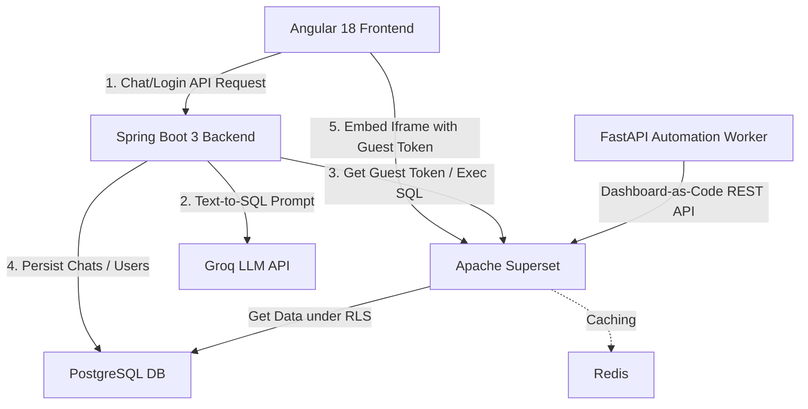

# VDT Data Platform (Phase 2) 🚀

Welcome to the **VDT Data Platform (Phase 2)** — an Enterprise Data Platform for Viettel Software featuring an **Agentic Text-to-SQL Chatbot** and automated **Dashboard-as-Code** orchestration. 

This platform allows authorized users to query stock market data using natural language, dynamically converting text into secure SQL queries executed under a strict, native **Row-Level Security (RLS)** layer managed by Apache Superset.

---

## 🏗️ Architecture & Component Overview

The system consists of five main layers designed to operate in absolute isolation:



1. **Angular 18 Frontend** (`/frontend`): A modern Single Page Application (SPA) providing a secure chatbot panel and integrated charts. It embeds the Superset dashboards securely using the `@superset-ui/embedded-sdk` and accesses the backend with a Bearer JWT interceptor.
2. **Spring Boot 3 Backend** (`/backend`): A Java 17 REST API handling authentication (JWT), chat history persistence, Groq LLM integration, and acting as a security/RLS proxy to Apache Superset.
3. **Apache Superset** (Dockerized): The data visualization and core Row-Level Security (RLS) engine. It executes all SQL queries on behalf of the users, dynamically appending RLS filters so that users only see data they are authorized to see.
4. **PostgreSQL 15 Database** (`db-init` & `vdt_postgres`): The centralized database storing transaction data, mock stock listings, users, session state, and chat history.
5. **FastAPI Automation Worker** (`/python-workers`): A Python microservice that uses the Superset REST API to automatically build charts and dashboards from dataset schemas on-demand.

---

## 🛠️ Tech Stack

* **Frontend:** Angular 18, RxJS, Tailwind CSS, `@superset-ui/embedded-sdk`
* **Backend:** Java 17, Spring Boot 3.3.0, Spring Security, JWT (jjwt)
* **Database:** PostgreSQL 15 (Star Schema)
* **Cache:** Redis 7 (used by Apache Superset)
* **LLM Integration:** Groq API (using Llama 3 / Mixtral for Text-to-SQL)
* **Automation:** Python 3.10+, FastAPI, Uvicorn, Requests
* **Orchestration:** Docker Compose

---

## 🔑 Pre-requisites & Credentials

Ensure you have a **Groq API Key** ready. You can obtain one from the [Groq Console](https://console.groq.com/).

### Built-in User Accounts (PostgreSQL)
These accounts are defined in [01_init_schema.sql](file:///c:/252/vdt-data-platform/vdt-data-platform/db-init/01_init_schema.sql):

| Username | Password | Role | Description |
| :--- | :--- | :--- | :--- |
| `investor_a` | `password123` | `ROLE_INVESTOR` | Retail investor (can only see their own transactions). |
| `broker_1` | `admin123` | `ROLE_BROKER` | Broker (can see data for all investors assigned to them). |

### Apache Superset Admin Credentials
* **Username:** `admin`
* **Password:** `admin`

---

## ⚡ Option 1: Quick Start with Docker Compose (Recommended)

This is the easiest way to launch the entire platform along with its supporting database, cache, and Superset configuration.

### Step 1: Set Up Environment Variables
Create or verify the presence of a `.env` file in the project root containing your **Groq API Key**:
```bash
GROQ_API_KEY=your_groq_api_key_here
```

### Step 2: Build and Run Services
Run the following command in the project root:
```bash
docker-compose up --build -d
```
This builds and starts the following containers:
* `vdt_postgres`: Centralized database initialized with schema and mock data.
* `vdt_redis`: Cache for Apache Superset.
* `vdt_superset`: Apache Superset engine.
* `vdt_superset_init`: A one-time setup container that upgrades the database, creates the admin user (`admin`/`admin`), and initializes permissions before terminating.
* `vdt_backend`: Spring Boot backend service.
* `vdt_frontend`: Angular client served via Nginx.

### Step 3: Verify the Setup
Once all containers show as healthy, access the components at the following URLs:

* **Angular Frontend UI:** [http://localhost:4200](http://localhost:4200)
* **Spring Boot API Swagger/Endpoints:** [http://localhost:8080](http://localhost:8080)
* **Apache Superset Console:** [http://localhost:8088](http://localhost:8088) (Login: `admin` / `admin`)
* **Postgres Database:** `localhost:5432` (User: `admin`, Password: `adminpassword`, Database: `vdt_db`)

To view container logs, run:
```bash
docker-compose logs -f
```

To stop the services:
```bash
docker-compose down
```

---

## ⚙️ Option 2: Running Components Individually (Local Development)

If you prefer to run services natively for development, follow the setup instructions below.

### 1. Database & Cache Setup
* Install **PostgreSQL 15** and **Redis**.
* Create a database named `vdt_db`.
* Run the initialization script [db-init/01_init_schema.sql](file:///c:/252/vdt-data-platform/vdt-data-platform/db-init/01_init_schema.sql) inside your database to construct the schemas, seed the tables, and populate **5,000+ mock transaction orders**.
* Keep Redis running locally on port `6379`.

### 2. Apache Superset Setup
* Ensure Superset is installed locally.
* Launch Superset with the configuration file [superset_config.py](file:///c:/252/vdt-data-platform/vdt-data-platform/superset_config.py):
  ```bash
  export SUPERSET_CONFIG_PATH=/path/to/superset_config.py
  superset db upgrade
  superset fab create-admin --username admin --firstname VDT --lastname Admin --email admin@vdt.com --password admin
  superset init
  superset run -p 8088 --with-threads --reload
  ```

### 3. Spring Boot Backend Setup
* Open [backend/src/main/resources/application.yml](file:///c:/252/vdt-data-platform/vdt-data-platform/backend/src/main/resources/application.yml) and configure your local Postgres settings, or set the environment variables:
  ```bash
  export SUPERSET_SECRET_KEY=your_superset_secret_key
  export API_KEY=your_api_key_here
  export AUTOMATION_WORKER_URL=http://localhost:8000
  export SPRING_DATASOURCE_URL=jdbc:postgresql://localhost:5432/vdt_db
  export SPRING_DATASOURCE_USERNAME=your_db_username
  export SPRING_DATASOURCE_PASSWORD=your_db_password
  ```
* Navigate to the `/backend` folder and run the Maven Spring Boot plugin:
  ```bash
  cd backend
  mvn clean spring-boot:run
  ```
* The backend will spin up on port `8080`.

### 4. Angular Frontend Setup
* Navigate to the `/frontend` folder:
  ```bash
  cd frontend
  npm install
  npm start
  ```
* Open [http://localhost:4200](http://localhost:4200) in your browser.
* Ensure configuration constants in [frontend/src/environments/environment.ts](file:///c:/252/vdt-data-platform/vdt-data-platform/frontend/src/environments/environment.ts) point to your local endpoints:
  ```typescript
  export const environment = {
    production: false,
    BACKEND_API_URL: 'http://localhost:8080/api',
    SUPERSET_DOMAIN: 'http://localhost:8088',
    SUPERSET_DASHBOARD_ID: '6' // Match the dashboard created in your Superset instance
  };
  ```

### 5. Python Automation Worker Setup
* Navigate to the `/python-workers` folder:
  ```bash
  cd python-workers
  pip install -r requirements.txt
  python main.py
  ```
* The microservice launches on [http://localhost:8000](http://localhost:8000). You can access interactive API Swagger docs at `http://localhost:8000/docs`.
* **Automate Dashboard Creation:** Trigger dashboard assembly in Superset by sending a POST request:
  ```bash
  curl -X POST "http://localhost:8000/api/create-dashboard" \
       -H "Content-Type: application/json" \
       -d '{"dataset_id": 1, "dashboard_title": "Automated Market Overview"}'
  ```

---

## 📊 Database Schema Details

The platform simulates a real stock brokerage dataset organized as a **Star Schema**:

* **`dim_tickers`** (Dimension): Catalog of listed securities (e.g., SSI, FPT, HPG, VNM, VCB).
* **`dim_brokers`** (Dimension): Internal brokerage managers in charge of client lists.
* **`dim_investors`** (Dimension): Client investor records mapped to their designated broker.
* **`fact_orders`** (Fact): Trade records containing `order_date`, `order_type` (BUY/SELL), `volume`, `price`, and `status` (Khớp, Chờ, Hủy).
* **`users`**: Platform security accounts linking front-end usernames with application roles.
* **`chat_sessions`** & **`chat_messages`**: Chat history audit logs for session-based AI interactions.

---

## 🛡️ Security & Row-Level Security (RLS) Rules

To enforce strict enterprise governance, the project ensures data protection through native **Apache Superset RLS** rather than trusting the LLM with user context:

1. **Text-to-SQL Isolation**: The Groq LLM receives the database schema *without* any user identify filters. It generates standard, generic queries (e.g. `SELECT * FROM fact_orders`).
2. **Superset Proxy Impersonation**: When Spring Boot routes the query to Superset, it provides the logged-in user's context.
3. **Automatic RLS Filters**: Superset intercepts the query and automatically injects constraints depending on the user's role:
   * **`ROLE_INVESTOR`**: Appends `WHERE investor_id = CURRENT_USER()`.
   * **`ROLE_BROKER`**: Appends `WHERE broker_id = CURRENT_BROKER()`.
4. **Secure Embedding**: Guest tokens generated via `POST /api/v1/security/guest_token/` carry pre-signed RLS rules, preventing client-side tampered visualizer views.
