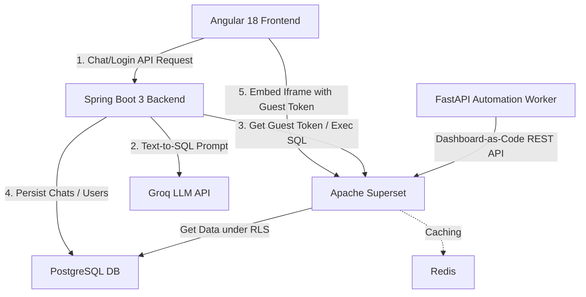

# VDT Data Platform (Phase 2) 🚀

Welcome to the **VDT Data Platform (Phase 2)** — an Enterprise Data Platform for Viettel Software featuring an **Agentic Text-to-SQL Chatbot** and automated **Dashboard-as-Code** orchestration. 

This platform allows authorized users to query stock market data using natural language, dynamically converting text into secure SQL queries executed under a strict, native **Row-Level Security (RLS)** layer managed by Apache Superset.

---

## 🏗️ Architecture & Component Overview

The system consists of five main layers designed to operate in absolute isolation:



1. **Angular 18 Frontend** (`/frontend`): A modern Single Page Application (SPA) providing a secure chatbot panel and integrated charts. It embeds the Superset dashboards securely using the `@superset-ui/embedded-sdk` and accesses the backend with a Bearer JWT interceptor.
2. **Spring Boot 3 Backend** (`/backend`): A Java 17 REST API handling authentication (JWT), chat history persistence, Groq LLM integration, and acting as a security/RLS proxy to Apache Superset.
3. **Apache Superset** (Dockerized): The data visualization and core Row-Level Security (RLS) engine. It executes all SQL queries on behalf of the users, dynamically appending RLS filters so that users only see data they are authorized to see.
4. **PostgreSQL 15 Database** (`db-init` & `vdt_postgres`): The centralized database storing transaction data, mock stock listings, users, session state, and chat history.
5. **FastAPI Automation Worker** (`/python-workers`): A Python microservice that uses the Superset REST API to automatically build charts and dashboards from dataset schemas on-demand.

---

## 🛠️ Tech Stack

* **Frontend:** Angular 18, RxJS, Tailwind CSS, `@superset-ui/embedded-sdk`
* **Backend:** Java 17, Spring Boot 3.3.0, Spring Security, JWT (jjwt)
* **Database:** PostgreSQL 15 (Star Schema)
* **Cache:** Redis 7 (used by Apache Superset)
* **LLM Integration:** Groq API (using Llama 3 / Mixtral for Text-to-SQL)
* **Automation:** Python 3.10+, FastAPI, Uvicorn, Requests
* **Orchestration:** Docker Compose

---

## 🔑 Pre-requisites & Credentials

Ensure you have a **Groq API Key** ready. You can obtain one from the [Groq Console](https://console.groq.com/).

### Built-in User Accounts (PostgreSQL)
These accounts are defined in [01_init_schema.sql](file:///c:/252/vdt-data-platform/vdt-data-platform/db-init/01_init_schema.sql):

| Username | Password | Role | Description |
| :--- | :--- | :--- | :--- |
| `investor_a` | `password123` | `ROLE_INVESTOR` | Retail investor (can only see their own transactions). |
| `broker_1` | `admin123` | `ROLE_BROKER` | Broker (can see data for all investors assigned to them). |

### Apache Superset Admin Credentials
* **Username:** `admin`
* **Password:** `admin`

---

## ⚡ Option 1: Quick Start with Docker Compose (Recommended)

This is the easiest way to launch the entire platform along with its supporting database, cache, and Superset configuration.

### Step 1: Set Up Environment Variables
Create or verify the presence of a `.env` file in the project root containing your **Groq API Key**:
```bash
GROQ_API_KEY=your_groq_api_key_here
```

### Step 2: Build and Run Services
Run the following command in the project root:
```bash
docker-compose up --build -d
```
This builds and starts the following containers:
* `vdt_postgres`: Centralized database initialized with schema and mock data.
* `vdt_redis`: Cache for Apache Superset.
* `vdt_superset`: Apache Superset engine.
* `vdt_superset_init`: A one-time setup container that upgrades the database, creates the admin user (`admin`/`admin`), and initializes permissions before terminating.
* `vdt_backend`: Spring Boot backend service.
* `vdt_frontend`: Angular client served via Nginx.

### Step 3: Verify the Setup
Once all containers show as healthy, access the components at the following URLs:

* **Angular Frontend UI:** [http://localhost:4200](http://localhost:4200)
* **Spring Boot API Swagger/Endpoints:** [http://localhost:8080](http://localhost:8080)
* **Apache Superset Console:** [http://localhost:8088](http://localhost:8088) (Login: `admin` / `admin`)
* **Postgres Database:** `localhost:5432` (User: `admin`, Password: `adminpassword`, Database: `vdt_db`)

To view container logs, run:
```bash
docker-compose logs -f
```

To stop the services:
```bash
docker-compose down
```

---

## ⚙️ Option 2: Running Components Individually (Local Development)

If you prefer to run services natively for development, follow the setup instructions below.

### 1. Database & Cache Setup
* Install **PostgreSQL 15** and **Redis**.
* Create a database named `vdt_db`.
* Run the initialization script [db-init/01_init_schema.sql](file:///c:/252/vdt-data-platform/vdt-data-platform/db-init/01_init_schema.sql) inside your database to construct the schemas, seed the tables, and populate **5,000+ mock transaction orders**.
* Keep Redis running locally on port `6379`.

### 2. Apache Superset Setup
* Ensure Superset is installed locally.
* Launch Superset with the configuration file [superset_config.py](file:///c:/252/vdt-data-platform/vdt-data-platform/superset_config.py):
  ```bash
  export SUPERSET_CONFIG_PATH=/path/to/superset_config.py
  superset db upgrade
  superset fab create-admin --username admin --firstname VDT --lastname Admin --email admin@vdt.com --password admin
  superset init
  superset run -p 8088 --with-threads --reload
  ```

### 3. Spring Boot Backend Setup
* Open [backend/src/main/resources/application.yml](file:///c:/252/vdt-data-platform/vdt-data-platform/backend/src/main/resources/application.yml) and configure your local Postgres settings, or set the environment variables:
  ```bash
  export SUPERSET_SECRET_KEY=your_superset_secret_key
  export API_KEY=your_api_key_here
  export AUTOMATION_WORKER_URL=http://localhost:8000
  export SPRING_DATASOURCE_URL=jdbc:postgresql://localhost:5432/vdt_db
  export SPRING_DATASOURCE_USERNAME=your_db_username
  export SPRING_DATASOURCE_PASSWORD=your_db_password
  ```
* Navigate to the `/backend` folder and run the Maven Spring Boot plugin:
  ```bash
  cd backend
  mvn clean spring-boot:run
  ```
* The backend will spin up on port `8080`.

### 4. Angular Frontend Setup
* Navigate to the `/frontend` folder:
  ```bash
  cd frontend
  npm install
  npm start
  ```
* Open [http://localhost:4200](http://localhost:4200) in your browser.
* Ensure configuration constants in [frontend/src/environments/environment.ts](file:///c:/252/vdt-data-platform/vdt-data-platform/frontend/src/environments/environment.ts) point to your local endpoints:
  ```typescript
  export const environment = {
    production: false,
    BACKEND_API_URL: 'http://localhost:8080/api',
    SUPERSET_DOMAIN: 'http://localhost:8088',
    SUPERSET_DASHBOARD_ID: '6' // Match the dashboard created in your Superset instance
  };
  ```

### 5. Python Automation Worker Setup
* Navigate to the `/python-workers` folder:
  ```bash
  cd python-workers
  pip install -r requirements.txt
  python main.py
  ```
* The microservice launches on [http://localhost:8000](http://localhost:8000). You can access interactive API Swagger docs at `http://localhost:8000/docs`.
* **Automate Dashboard Creation:** Trigger dashboard assembly in Superset by sending a POST request:
  ```bash
  curl -X POST "http://localhost:8000/api/create-dashboard" \
       -H "Content-Type: application/json" \
       -d '{"dataset_id": 1, "dashboard_title": "Automated Market Overview"}'
  ```

---

## 📊 Database Schema Details

The platform simulates a real stock brokerage dataset organized as a **Star Schema**:

* **`dim_tickers`** (Dimension): Catalog of listed securities (e.g., SSI, FPT, HPG, VNM, VCB).
* **`dim_brokers`** (Dimension): Internal brokerage managers in charge of client lists.
* **`dim_investors`** (Dimension): Client investor records mapped to their designated broker.
* **`fact_orders`** (Fact): Trade records containing `order_date`, `order_type` (BUY/SELL), `volume`, `price`, and `status` (Khớp, Chờ, Hủy).
* **`users`**: Platform security accounts linking front-end usernames with application roles.
* **`chat_sessions`** & **`chat_messages`**: Chat history audit logs for session-based AI interactions.

---

## 🛡️ Security & Row-Level Security (RLS) Rules

To enforce strict enterprise governance, the project ensures data protection through native **Apache Superset RLS** rather than trusting the LLM with user context:

1. **Text-to-SQL Isolation**: The Groq LLM receives the database schema *without* any user identify filters. It generates standard, generic queries (e.g. `SELECT * FROM fact_orders`).
2. **Superset Proxy Impersonation**: When Spring Boot routes the query to Superset, it provides the logged-in user's context.
3. **Automatic RLS Filters**: Superset intercepts the query and automatically injects constraints depending on the user's role:
   * **`ROLE_INVESTOR`**: Appends `WHERE investor_id = CURRENT_USER()`.
   * **`ROLE_BROKER`**: Appends `WHERE broker_id = CURRENT_BROKER()`.
4. **Secure Embedding**: Guest tokens generated via `POST /api/v1/security/guest_token/` carry pre-signed RLS rules, preventing client-side tampered visualizer views.


---
1. System Architecture Overview

graph TD
    Browser["🌐 Browser<br/>:4200"]

    subgraph Docker_Network
        Angular["Angular Frontend<br/>Nginx :4200"]
        Spring["Spring Boot<br/>:8080"]
        Python["FastAPI Python Worker<br/>:8000 (internal only)"]
        Superset["Apache Superset<br/>:8088"]
        Postgres[("PostgreSQL<br/>:5432<br/>vdt_db")]
        Redis[("Redis<br/>:6379")]
    end

    Codex["☁️ Codex API<br/>(External LLM)"]

    Browser -->|HTTP :4200| Angular
    Browser -->|iframe SSO| Superset
    Browser -->|GET /api/exports/token| Spring

    Angular -->|REST /api/*<br/>Authorization: Bearer JWT| Spring

    Spring -->|POST /api/chat<br/>X-Internal-Api-Key| Python
    Spring -->|POST /api/create-dashboard<br/>X-Internal-Api-Key| Python
    Spring -->|StringRedisTemplate<br/>csv_export:token| Redis
    Spring -->|JPA ORM<br/>users / chat_sessions / chat_messages| Postgres

    Python -->|psycopg2<br/>RLS SELECT on fact_orders| Postgres
    Python -->|psycopg2<br/>INSERT ab_permission_view_role| Postgres
    Python -->|redis SETEX<br/>csv_export:token TTL=900s| Redis
    Python -->|REST /api/v1/chart & dashboard<br/>admin session| Superset
    Python -->|openai.chat.completions<br/>Tool call loop| Codex

    Superset -->|SQLAlchemy<br/>metadata + chart data| Postgres
    Superset -->|RedisCache<br/>query result cache| Redis

---
2. Authentication Flow

sequenceDiagram
    actor U as User
    participant A as Angular
    participant S as Spring Boot :8080
    participant P as FastAPI :8000
    participant C as Codex API
    participant DB as PostgreSQL

    U->>A: Enter prompt and click Send
    A->>S: POST /api/chat<br/>Authorization: Bearer JWT

    S->>S: Validate JWT
    S->>DB: INSERT user message
    S->>P: POST /api/chat<br/>X-Internal-Api-Key

    P->>DB: Load conversation history
    P->>C: openai.chat.completions()

    loop Tool call (optional)
        C-->>P: Tool request
        P->>P: Execute tool
        P->>C: Tool result
    end

    C-->>P: Final AI response

    P->>DB: Save assistant message
    P-->>S: Response JSON

    S->>DB: Persist chat metadata
    S-->>A: 200 OK {response}

    A-->>U: Display AI response
---
3. Dashboard Load & Superset SSO Embedding

sequenceDiagram
    participant A as Angular<br/>:4200
    participant S as Spring Boot<br/>:8080
    participant PW as FastAPI Worker<br/>:8000
    participant SS as Apache Superset<br/>:8088
    participant DB as PostgreSQL
    participant I as Browser Iframe

    A->>S: GET /api/superset/sso-login<br/>Authorization: Bearer JWT

    S->>S: Validate JWT<br/>Extract username
    S->>DB: Query user role

    S->>S: getDashboardUuid()

    alt Dashboard not cached
        S->>PW: POST /api/create-dashboard<br/>X-Internal-Api-Key

        PW->>SS: Login as admin
        SS-->>PW: Access token + CSRF

        PW->>SS: Find/Create database
        PW->>SS: Find/Create dataset
        PW->>SS: Create 6 charts
        PW->>SS: Create dashboard
        PW->>SS: Create RLS policy
        PW->>SS: Assign Gamma role

        PW-->>S: dashboardId
        S->>S: Cache dashboardId

    else Dashboard cached
        Note over S: Reuse cached dashboardId
    end

    S->>S: Generate SSO JWT<br/>username + role<br/>TTL = 1 hour

    S-->>A: {token, dashboardId}

    A->>A: Build iframe URL
    A->>A: Sanitize URL
    A->>I: Set iframe src

    I->>SS: GET /login/custom?token=...

    SS->>SS: Decode JWT
    SS->>SS: Find/Create user
    SS->>SS: Login user
    SS-->>I: Redirect to dashboard

    I->>SS: GET /superset/dashboard/{id}

    SS->>SS: Apply Row-Level Security<br/>Investor or Broker filter

    SS-->>I: Dashboard HTML

---
4. Chat / AI Agentic Loop (Main Flow)

mermaid
sequenceDiagram
    actor U as User
    participant A as Angular
    participant S as Spring Boot
    participant DB as PostgreSQL
    participant PW as Python Worker
    participant C as Codex API (LLM)
    participant SS as Superset
    participant R as Redis

    U->>A: Type message → click Send
    A->>A: Push user message to messages[]
    A->>S: POST /api/chat/query\n{sessionId, query}\nAuthorization: Bearer JWT

    S->>S: AuthTokenFilter validates JWT\nextracts username
    S->>DB: findById(sessionId) → verify session belongs to this user
    S->>DB: findBySessionId → load full chat history
    S->>DB: findByUsername → get user role
    S->>DB: save ChatMessage (senderType=USER)

    S->>PW: POST /api/chat\n{query, username, role, history}\nX-Internal-Api-Key

    PW->>PW: require_internal_key() verifies header
    PW->>C: chat.completions.create\n(model=CODEX_MODEL, messages, 13 tools, temp=0.1)
    C-->>PW: {tool_calls: [...]}

    loop Agentic tool loop (until no more tool_calls)
        alt Tool: get_superset_schema
            PW->>SS: GET /api/v1/dataset/{id} (admin, cached 5min)
            SS-->>PW: Column metadata
            PW-->>C: Schema string (table + column + type)

        else Tool: query_dashboard_data
            PW->>PW: _validate_columns() against live schema
            PW->>PW: _validate_sql_expression() — block DDL/injections
            PW->>DB: psycopg2 parameterized SELECT\nWHERE investor_id = %s (RLS)
            DB-->>PW: RLS-filtered rows (RealDictCursor)
            PW-->>C: JSON rows

        else Tool: create_custom_chart
            PW->>PW: _validate_columns()\n_normalize_chart_params()\nfix metric shape + x_axis
            PW->>DB: psycopg2 _grant_gamma_datasource_access()\nINSERT ab_permission_view_role
            PW->>SS: POST /api/v1/chart/ (no owners in payload)
            SS-->>PW: {id: chart_id}
            PW->>SS: PUT /api/v1/chart/{id}\n{query_context, query_context_generation}
            PW->>SS: GET /api/v1/chart/{id}/data/ (_verify_chart)
            alt Chart renders OK
                PW->>SS: PUT /api/v1/chart/{id} {owners: [superset_user_id]}
                PW-->>C: "Chart created and verified. ID: N"
            else Chart fails to render
                PW->>SS: DELETE /api/v1/chart/{id} (rollback)
                PW-->>C: "Rolled back. Superset error: ... retry with fixes"
            end

        else Tool: summarize_chart / detect_anomalies
            PW->>DB: psycopg2 via query_dashboard_data (RLS enforced)
            DB-->>PW: Filtered rows
            PW->>PW: Compute IQR stats (detect_anomalies)
            PW-->>C: JSON with rows / anomaly report

        else Tool: export_chart_csv
            PW->>DB: psycopg2 via query_dashboard_data (RLS enforced)
            DB-->>PW: Filtered rows
            PW->>PW: csv.DictWriter → CSV text
            PW->>R: SETEX csv_export:token 900 CSV\nSETEX csv_export:token:filename 900 name.csv
            PW-->>C: {download_url: "http://backend/api/exports/token", expires_in: 15min}

        else Tool: change_chart_type
            PW->>SS: GET /api/v1/chart/{id} → verify ownership
            PW->>PW: _normalize_chart_params() + _build_query_context()
            PW->>SS: PUT /api/v1/chart/{id} {viz_type, params, query_context}
            PW->>SS: GET /api/v1/chart/{id}/data/ (_verify_chart)
            alt New type renders OK
                PW-->>C: "Switched to X [OPEN_CHART:N]"
            else New type fails
                PW->>SS: PUT /api/v1/chart/{id} (revert to original params)
                PW-->>C: "Reverted. Try a different viz_type"
            end

        else Tool: delete_chart
            PW->>SS: GET /api/v1/chart/{id} → check owners list
            PW->>SS: GET /api/v1/dashboard/{id} → read position_json\nremove CHART-* node + prune empty ROW-*
            PW->>SS: PUT /api/v1/dashboard/{id} (cleaned layout)
            PW->>SS: DELETE /api/v1/chart/{id}
            PW-->>C: "Deleted and removed from dashboards"

        else Tool: create_custom_dashboard / add_charts / delete_dashboard / get_dashboard_by_name
            PW->>SS: Respective /api/v1/dashboard/ calls
            PW-->>C: Result
        end

        C-->>PW: Next {tool_calls} or final {content}
    end

    PW-->>S: {reply: "Final AI response text"}
    S->>DB: save ChatMessage (senderType=AI)
    S-->>A: {reply: "Final AI response text"}

    A->>A: Parse [OPEN_CHART:N] → navigateIframe(/superset/explore/?slice_id=N)
    A->>A: Parse [OPEN_DASHBOARD:N] → navigateIframe(/superset/dashboard/N/)
    A->>A: renderMarkdown(reply) → SafeHtml\n(convert **bold**, links, lists, code blocks)
    A->>A: Push agent message, saveSession() → localStorage
    A-->>U: Display AI reply + update iframe

---
5. CSV Export Download Flow

mermaid
sequenceDiagram
    actor U as User (Browser)
    participant A as Angular Chat UI
    participant S as Spring Boot :8080
    participant R as Redis

    Note over A: AI reply contains:\n[Download CSV](http://localhost:8080/api/exports/abc123)
    A->>A: renderMarkdown() renders as HTML anchor tag
    A-->>U: Show clickable "Download CSV" link

    U->>S: GET /api/exports/abc123\n(no Authorization header — public endpoint)
    S->>S: SecurityConfig: /api/exports/** → permitAll()
    S->>S: ExportController: validate token\nregex [a-fA-F0-9\\-]{16,64} — block injection

    S->>R: GET csv_export:abc123
    alt Token valid, not expired (within 15 min)
        R-->>S: CSV text string
        S->>R: GET csv_export:abc123:filename
        R-->>S: "Orders_by_Status.csv"
        S->>S: Prepend UTF-8 BOM (0xEF 0xBB 0xBF)\nfor Excel Vietnamese character support
        S-->>U: 200 text/csv\nContent-Disposition: attachment; filename="Orders_by_Status.csv"\n+ BOM + CSV bytes
        U->>U: Browser triggers file download
    else Token expired or never existed
        R-->>S: null
        S-->>U: 410 Gone
    end

---
6. Row-Level Security (Dual-Layer Model)

mermaid
flowchart TD
    USER["Authenticated User\n(username, role)"]

    USER --> PATH1["📊 Superset iframe\n(chart rendering)"]
    USER --> PATH2["🤖 AI chatbot tools\n(query / summarize / detect / export)"]

    subgraph Layer1["Layer 1 — Superset Native RLS (Jinja2)"]
        PATH1 --> SS["Superset evaluates\nRLS clause on fact_orders\nfor Gamma role"]
        SS --> J1["ROLE_INVESTOR\ninvestor_id = current_username()"]
        SS --> J2["ROLE_BROKER\ninvestor_id IN\n(SELECT investor_id FROM dim_investors\nWHERE broker_id = current_username())"]
    end

    subgraph Layer2["Layer 2 — Python Worker Parameterized SQL"]
        PATH2 --> PW["query_dashboard_data()\nbuilds SQL in Python"]
        PW --> P1["ROLE_INVESTOR\nWHERE investor_id = %s\nparams = username"]
        PW --> P2["ROLE_BROKER\nWHERE investor_id IN\n(SELECT investor_id FROM dim_investors\nWHERE broker_id = %s)\nparams = username"]
    end

    J1 --> DB[("fact_orders\nPostgreSQL")]
    J2 --> DB
    P1 --> DB
    P2 --> DB

    DB --> |"Only this user's rows"| SAFE["✅ RLS-filtered data\n(model never sees other users' rows)"]

    subgraph Guard["SQL Injection Guards (Layer 2 only)"]
        PW --> V1["_validate_sql_expression()\nOnly AGGREGATE(col) patterns allowed\nBlocks semicolons, DDL, system tables"]
        PW --> V2["_safe_identifier()\nRejects non-word characters in column names"]
        PW --> V3["_validate_columns()\nPre-flight check against live Superset schema"]
    end

---